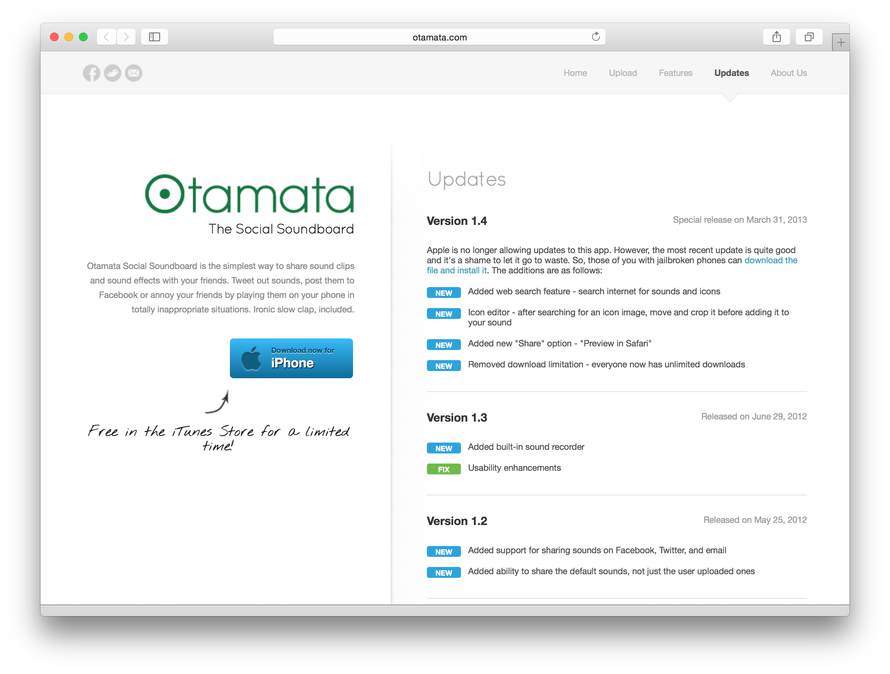

Otamata API & Website
=====================

Here's the backend API and website to support the [Otamata iOS app](https://github.com/jbaumbach/Otamata-iOS).  The API uses Microsoft .NET,
Microsoft SQL Server, and digest authentication.  

Screenshots
-----------
There's not much to see of the API, but here are some views of the website.

<table cellpadding="10">

<tr>
<td width="500"></td>
<td>Website homepage. Nice and responsive with some cool screenshots.</td>
</tr>

<tr>
<td></td>
<td>The upload page.  Since iOS apps aren't allowed to access the device's media (at the time), the best solution was to 
have the users upload their media from their computer through the API, then download to their devices.  Seemed reasonable
enough.</td>
</tr>

<tr>
<td></td>
<td>A page showing the app's features.</td>
</tr>

<tr>
<td></td>
<td>A page showing the updates for each release.</td>
</tr>

<tr>
<td></td>
<td>The about page, written by a professional writer! (my wife)</td>
</tr>

</table>

